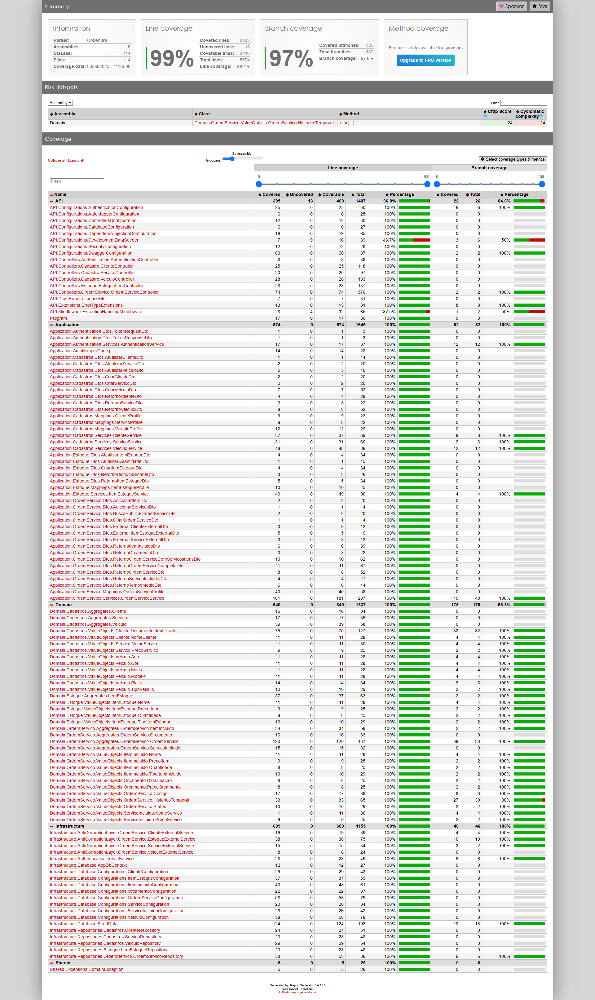

# 11. Testes

## Estrutura de Testes
Localização: `src/Tests/`
- **xUnit**: Framework principal de testes unitários
- **Moq**: Framework para criação de mocks e stubs
- **FluentAssertions**: Asserções mais legíveis e expressivas
- **Coverlet**: Coleta de métricas de cobertura
- **reportgenerator.io**: Geração de relatório a partir do Coverlet

## Tipos de Teste

- **Application**: Testes unitários, testam a camada de application, com mock para outros services e repositories, com o objetivo de garantir que a orquestração e chamadas ocorram como esperado. Usam principalmente Facts específicos para cenário.
- **Domain**: Testes unitários, testam a camada de domínio, não usam mocks, com objetivo de testar as regras de negócio dos aggregates e seus value objects. Usam principalmente Theory e InlineData para validar os parâmetros de entrada.
- **Integration**: Testes de integração, usam um banco de dados InMemory e não usam mock, criam todos os dados necessários para testar um fluxo de ponta a ponta. Validam se o retorno HTTP é o esperado e se os dados foram persistidos corretamente.
- **Other**: Testes para cenários específicos como autenticação e filtro de exceptions.

## Relatório de cobertura

Disponível completo em [CoverageReport.zip](attachments/CoverageReport.zip).

**Observação**: os arquivos de Migrations gerados pelo EF Core foram removidos da cobertura, pois são códigos gerados automaticamente e não precisam de testes unitários. 

**Ressalvas**: o teste não atingiu uma cobertura de 100% devido a trechos de configuração no projeto da API, e a um caso específico do Value Object `OrdemServico.HistoricoTemporal`, que aponta que nem todos os caminhos possíveis foram testados. Realizei estes testes manualmente com sucesso e acredito que seja uma falha do Coverlet em detectar condições aninhadas.

**Resumo**

---
Anterior: [API](10_api.md)  
Próximo: [Qualidade e Segurança](12_qualidade_seguranca.md)
