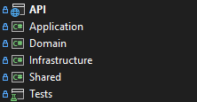

# 8. Arquitetura

A aplicação segue os princípios da **Clean Architecture** e **Domain-Driven Design (DDD)**, organizando o código em camadas bem definidas com baixo acoplamento e alta coesão.

## Estrutura de Camadas

### 1. API
- **Localização**: `src/OficinaMecanica/`
- **Responsabilidades**:
  - Ponto de entrada da aplicação
  - Controllers para exposição dos endpoints
  - Configurações de middleware e serviços

### 2. Application
- **Localização**: `src/Application/`
- **Responsabilidades**:
  - Orquestrar a comunicação entre bounded contexts
  - DTOs para entrada e saída de dados
  - Interfaces de services e repositories

### 3. Domain
- **Localização**: `src/Domain/`
- **Responsabilidades**:
  - Entidades de domínio
  - Aggregates e Value Objects
  - Regras de negócio

### 4. Infrastructure
- **Localização**: `src/Infrastructure/`
- **Responsabilidades**:
  - Implementação de repositórios
  - Contexto do Entity Framework
  - Configurações de banco de dados
  - Anti-Corruption Layer

### 5. Shared
- **Localização**: `src/Shared/`
- **Responsabilidades**:
  - Exceptions customizadas
  - Atributos de marcação

---
Anterior: [Banco de Dados](7_banco_dados.md)  
Próximo: [Particularidades](9_particularidades.md)
