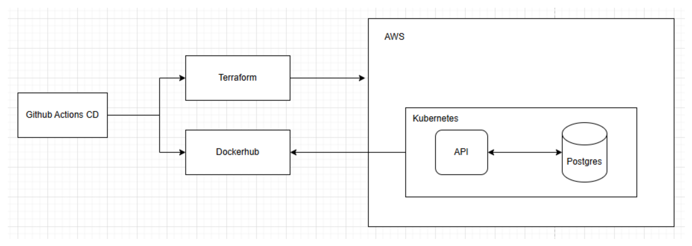

# 4. Arquitetura

## Fluxo de Deployment

1. **Desenvolvimento**
   - Código fonte versionado no GitHub
   - Feature branches com Pull Requests para a branch main

2. **CI**
   - Acionada por Pull Requests
   - Compila o código e executa testes
   - Valida configurações do Terraform
   - Protege a branch main de código quebrado

3. **CD**
   - Acionada após merge na branch main
   - Compila e testa a aplicação
   - Constrói e publica imagens Docker com tag única
   - Aplica infraestrutura Terraform na AWS
   - Atualiza manifestos Kubernetes com nova imagem
   - Aplica configurações no EKS

4. **Infraestrutura**
   - Provisiona recursos AWS via Terraform

## Diagrama de Arquitetura

---
Anterior: [Clean Architecture](3_clean_architecture.md)  
Próximo: [Endpoints](5_endpoints.md)