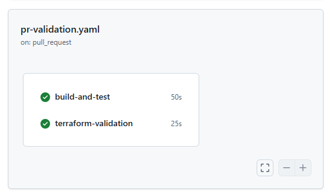
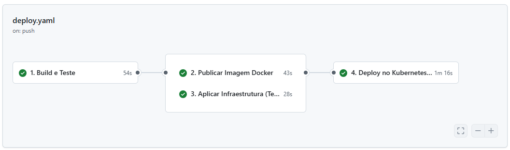

# 7. CI/CD com Github Actions

A CI/CD é feita através do Github Actions. A definição das pipelines está em `.github/workflows`.

## Pipeline de Integração Contínua (CI)

A pipeline de CI é acionada em cada Pull Request para a branch `main`. A branch `main` tem uma proteção para que o Pull Request só possa ser aceito quando a CI não apresentar falhas.

### Pipeline de CI (`pr-validation.yaml`)

1. **Build e Testes**
   - Compila o código em modo Release
   - Executa testes unitários
   - Gera e publica relatório de testes

2. **Validação Terraform**
   - Valida configurações na pasta `infra/` (quando alterada)
   - Executa `terraform plan` para verificar mudanças propostas

### Proteção da Branch Main

- A branch `main` aceita apenas código via Pull Requests aprovados
- Push direto para `main` é bloqueado
- PRs são aprovados somente quando:
  - Todos os testes passam
  - Validação do Terraform é bem-sucedida (quando há alteração na pasta `infra/`)
  - Reviewer aprova as alterações

## Pipeline de Entrega Contínua (CD)

Após merge na `main`, a pipeline de CD (`deploy.yaml`) executa automaticamente:

1. **Build e Teste**
   - Compila a aplicação e executa testes

2. **Publicação Docker**
   - Gera tag única (formato: `vYYYYMMDD-HHMMSS-<SHA>`)
   - Constrói e publica imagem no Docker Hub

3. **Infraestrutura Terraform**
   - Aplica configurações de infraestrutura na AWS

4. **Deploy no Kubernetes (AWS EKS)**
   - Atualiza manifestos com nova tag da imagem
   - Aplica configurações no cluster EKS
   - Verifica status do deployment

---
Anterior: [Infraestrutura](6_infraestrutura.md)  
Próximo: [Qualidade](8_qualidade.md)